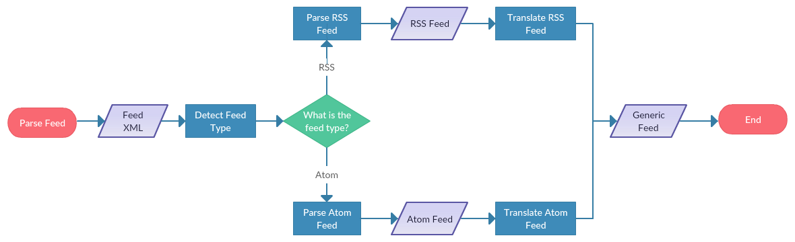

# gofeed

[](https://coveralls.io/github/mmcdole/gofeed?branch=master) [](https://goreportcard.com/report/github.com/mmcdole/gofeed) [](http://godoc.org/github.com/mmcdole/gofeed) [](http://doge.mit-license.org)

Introducing the `gofeed` library, a versatile feed parser designed to accommodate a wide range of popular feed formats, including [RSS](https://en.wikipedia.org/wiki/RSS), [Atom](https://en.wikipedia.org/wiki/Atom_(standard)), and [JSON Feed](https://jsonfeed.org/version/1). With a focus on flexibility and ease of use, this library streamlines the process of parsing various feeds into a unified format.

For a seamless parsing experience across all supported formats, employ the universal `gofeed.Parser`. Alternatively, if your needs are tailored to a specific feed format, make use of the dedicated parsers: `rss.Parser`, `atom.Parser`, and `json.Parser`. These specialized parsers ensure optimal performance and accuracy when working with a particular feed type.


## Table of Contents

- [Getting Started](#getting-started)
  - [Installation](#installation)
  - [Basic Usage](#basic-usage)
- [Feed Parsing](#feed-parsing)
  - [Universal Parser (gofeed.Parser)](#universal-parser-gofeedparser)
  - [Dedicated Parsers](#dedicated-parsers)
  - [Supported Input Types](#supported-input-types)
    - [io.Reader](#ioreader)
    - [String](#string)
    - [URL](#url)
  - [Supported Feed Types](#supported-feed-types)
- [Advanced Usage](#advanced-usage)
  - [Universal Parser Mapping](#universal-parser-mapping)
  - [Extensions](#extensions)
  - [Parsing Strictness](#parsing-strictness)
- [Contributing](#contributing)
  - [Reporting Issues](#reporting-issues)
  - [Submitting Pull Requests](#submitting-pull-requests)
  - [Development Guidelines](#development-guidelines)
  - [Credits](#credits)
- [License](#license)

## Getting Started

### Installation

To install the `gofeed` library, use the `go get` command:

```bash
go get github.com/mmcdole/gofeed/v2
```

This will download and install the latest version of the gofeed library. Make sure to add the /v2 suffix to the import path to ensure you are using the latest version.

### Basic Usage

Once you have successfully installed the gofeed library, you can import it into your Go project by adding the following import statement:

```go
import "github.com/mmcdole/gofeed/v2"
```

To use the universal gofeed parser, create a new instance of the gofeed.Parser and use it's Parse functions to parse a feed from a URL, an io.Reader, or a string containing the feed XML or JSON content.

Here's a simple example of using the gofeed.Parser to parse a feed from a URL:

```go
package main

import (
	"fmt"
	"github.com/mmcdole/gofeed/v2"
)

func main() {
	fp := gofeed.NewParser()
	feed, err := fp.ParseURL("https://example.com/feed.xml")

	if err != nil {
		fmt.Printf("Error: %s", err)
		return
	}

	fmt.Printf("Feed title: %s\n", feed.Title)
}
```
This example demonstrates how to create a new instance of the gofeed.Parser, parse a feed from a URL, and output the feed's title.

## Feed Parsing

### Universal Parser (gofeed.Parser)


The Universal Parser, `gofeed.Parser`, is designed to automatically detect the feed type, parse the content using the appropriate feed-specific parser, and then convert the parsed data into a unified format.

The process can be summarized in the following steps:

1. **Feed type detection**: The Universal Parser analyzes the provided feed content and identifies its type (RSS, Atom, or JSON) based on the structure and elements present.
2. **Feed specific parsing**: Once the feed type is determined, the corresponding feed-specific parser (`rss.Parser`, `atom.Parser`, or `json.Parser`) is used to parse the content.
3. **Feed Conversion**: After parsing, the data is converted into a common format, making it easy to work with, regardless of the original feed type.

This process ensures that the Universal Parser can handle a wide variety of feed types and present the data in a consistent and unified format, simplifying the process for developers.


### Dedicated Parsers

While the Universal Parser (`gofeed.Parser`) provides a convenient way to handle multiple feed types and convert them into a unified format, there might be cases where you want to work with a specific feed type directly. The `gofeed` library offers dedicated parsers for each supported feed type: RSS, Atom, and JSON.

These dedicated parsers provide more granular control over the parsing process and enable you to work with the original structure of the specific feed type. Here's an overview of the dedicated parsers:

#### RSS Parser

The `rss.Parser` is designed to parse RSS feeds, handling various versions from RSS 0.90 to RSS 2.0. To use the `rss.Parser`, create a new instance and call the `Parse` method with the feed input:

```go
package main

import (
	"fmt"
	"github.com/mmcdole/gofeed/v2/parsers/rss"
)

func main() {
	rssParser := rss.NewParser()
	rssFeedString := `
<?xml version="1.0" encoding="UTF-8"?>
<rss version="2.0">
  <channel>
    <title>Example RSS Feed</title>
    <link>https://www.example.com</link>
    <description>An example RSS feed.</description>
    <managingEditor>jane.doe@example.com (Jane Doe)</managingEditor>
  </channel>
</rss>
`
	rssFeed, err := rssParser.ParseString(rssFeedString)

	if err != nil {
		fmt.Printf("Error: %s", err)
		return
	}

	fmt.Printf("Managing Editor: %s\n", rssFeed.ManagingEditor)
}
```

Note that this example prints the managingEditor property, which is not available in the unified format used by the Universal Parser.

Supported Feed Versions:
* RSS 0.90
* Netscape RSS 0.91
* Userland RSS 0.91
* RSS 0.92
* RSS 0.93
* RSS 0.94
* RSS 1.0
* RSS 2.0

#### Atom Parser

The `atom.Parser` is tailored for parsing Atom feeds, supporting both Atom 0.3 and Atom 1.0. To use the `atom.Parser`, create a new instance and call the `Parse` method with the feed input:

```go
package main

import (
	"fmt"
	"github.com/mmcdole/gofeed/v2/parsers/atom"
)

func main() {
	atomParser := atom.NewParser()
	atomFeedString := `
<?xml version="1.0" encoding="utf-8"?>
<feed xmlns="http://www.w3.org/2005/Atom">
  <title>Example Atom Feed</title>
  <link href="https://www.example.com"/>
  <updated>2021-12-15T05:00:00Z</updated>
  <author>
    <name>Jane Doe</name>
    <email>jane.doe@example.com</email>
  </author>
  <id>urn:uuid:1234-5678-9012-3456</id>
</feed>
`
	atomFeed, err := atomParser.ParseString(atomFeedString)

	if err != nil {
		fmt.Printf("Error: %s", err)
		return
	}

	fmt.Printf("Author: %s (%s)\n", atomFeed.Author.Name, atomFeed.Author.Email)
}
```

Supported Feed Versions:
* Atom 0.3
* Atom 1.0

#### JSON Feed Parser

The `json.Parser` is designed for parsing JSON feeds, supporting JSON Feed 1.0 and 1.1. To use the `json.Parser`, create a new instance and call the `Parse` method with the feed input:

```go
package main

import (
	"fmt"
	"github.com/mmcdole/gofeed/v2/parsers/json"
)

func main() {
	jsonParser := json.NewParser()
	jsonFeedString := `
{
  "version": "https://jsonfeed.org/version/1.1",
  "title": "Example JSON Feed",
  "home_page_url": "https://www.example.com",
  "favicon": "https://www.example.com/favicon.ico",
  "items": [
    {
      "id": "https://www.example.com/article",
      "url": "https://www.example.com/article",
      "title": "Example Article",
      "content_text": "An example article in the JSON feed.",
      "date_published": "2021-12-15T05:00:00Z"
    }
  ]
}
`
	jsonFeed, err := jsonParser.ParseString(jsonFeedString)

	if err != nil {
		fmt.Printf("Error: %s", err)
		return
	}

	fmt.Printf("Favicon: %s\n", jsonFeed.Favicon)
}
```

Supported Feed Types:
* JSON 1.0
* JSON 1.1

### Supported Input Types

### Supported Feed Types


* Atom 0.3
* Atom 1.0


#### io.Reader

#### String

#### URL

## Advanced Usage

### Universal Parser Mapping

### Extensions

### Parsing Strictness

## Contributing

### Reporting Issues

### Submitting Pull Requests

### Development Guidelines

### Credits

## License


## License


## Features

#### Supported feed types:

#### Extension Support

The `gofeed` library provides support for parsing several popular predefined extensions into ready-made structs, including [Dublin Core](http://dublincore.org/documents/dces/) and [Apple’s iTunes](https://help.apple.com/itc/podcasts_connect/#/itcb54353390).

It parses all other feed extensions in a generic way (see the [Extensions](#extensions) section for more details).

#### Invalid Feeds

A best-effort attempt is made at parsing broken and invalid XML feeds. Currently, `gofeed` can successfully parse feeds with the following issues:

* Unescaped/Naked Markup in feed elements
* Undeclared namespace prefixes
* Missing closing tags on certain elements
* Illegal tags within feed elements without namespace prefixes
* Missing "required" elements as specified by the respective feed specs.
* Incorrect date formats

## Overview

The `gofeed` library is comprised of a universal feed parser and several feed specific parsers. Which one you choose depends entirely on your usecase. If you will be handling rss, atom and json feeds then it makes sense to use the `gofeed. Parser` . If you know ahead of time that you will only be parsing one feed type then it would make sense to use `rss.Parser` or `atom.Parser` or `json. Parser` .

#### Universal Feed Parser

The universal `gofeed.Parser` works in 3 stages: detection, parsing and translation. It first detects the feed type that it is currently parsing. Then it uses a feed specific parser to parse the feed into its true representation which will be either a `rss.Feed` or `atom.Feed` or `json. Feed` . These models cover every field possible for their respective feed types. Finally, they are _translated_ into a `gofeed.Feed` model that is a hybrid of all feed types. Performing the universal feed parsing in these 3 stages allows for more flexibility and keeps the code base more maintainable by separating RSS, Atom and Json parsing into seperate packages.



The translation step is done by anything which adheres to the `gofeed.Translator` interface. The `DefaultRSSTranslator` , `DefaultAtomTranslator` , `DefaultJSONTranslator` are used behind the scenes when you use the `gofeed.Parser` with its default settings. You can see how they translate fields from `atom.Feed` or `rss.Feed`  `json. Feed` to the universal `gofeed.Feed` struct in the [Default Mappings](#default-mappings) section. However, should you disagree with the way certain fields are translated you can easily supply your own `gofeed.Translator` and override this behavior. See the [Advanced Usage](#advanced-usage) section for an example how to do this.

#### Feed Specific Parsers

The `gofeed` library provides two feed specific parsers: `atom. Parser` , `rss.Parser` and `json. Parser` . If the hybrid `gofeed.Feed` model that the universal `gofeed.Parser` produces does not contain a field from the `atom.Feed` or `rss.Feed` or `json.Feed` model that you require, it might be beneficial to use the feed specific parsers. When using the `atom.Parser` or `rss.Parser` or `json.Parser` directly, you can access all of fields found in the `atom. Feed` , `rss.Feed` and `json.Feed` models. It is also marginally faster because you are able to skip the translation step.

## Basic Usage

#### Universal Feed Parser

The most common usage scenario will be to use `gofeed.Parser` to parse an arbitrary RSS or Atom or JSON feed into the hybrid `gofeed.Feed` model. This hybrid model allows you to treat RSS, Atom and JSON feeds the same.

##### Parse a feed from an URL:

```go
fp := gofeed.NewParser()
feed, _ := fp.ParseURL("http://feeds.twit.tv/twit.xml")
fmt.Println(feed.Title)
```

##### Parse a feed from a string:

```go
feedData := `<rss version="2.0">
<channel>
<title>Sample Feed</title>
</channel>
</rss>`
fp := gofeed.NewParser()
feed, _ := fp.ParseString(feedData)
fmt.Println(feed.Title)
```

##### Parse a feed from an io. Reader:

```go
file, _ := os.Open("/path/to/a/file.xml")
defer file.Close()
fp := gofeed.NewParser()
feed, _ := fp.Parse(file)
fmt.Println(feed.Title)
```

##### Parse a feed from an URL with a 60s timeout:

```go
ctx, cancel := context.WithTimeout(context.Background(), 60*time.Second)
defer cancel()
fp := gofeed.NewParser()
feed, _ := fp.ParseURLWithContext("http://feeds.twit.tv/twit.xml", ctx)
fmt.Println(feed.Title)
```

##### Parse a feed from an URL with a custom User-Agent:

```go
fp := gofeed.NewParser()
fp.UserAgent = "MyCustomAgent 1.0"
feed, _ := fp.ParseURL("http://feeds.twit.tv/twit.xml")
fmt.Println(feed.Title)
```

#### Feed Specific Parsers

You can easily use the `rss. Parser` , `atom.Parser` or `json.Parser` directly if you have a usage scenario that requires it:

##### Parse a RSS feed into a `rss. Feed`

```go
feedData := `<rss version="2.0">
<channel>
<webMaster>example@site.com (Example Name)</webMaster>
</channel>
</rss>`
fp := rss.Parser{}
rssFeed, _ := fp.Parse(strings.NewReader(feedData))
fmt.Println(rssFeed.WebMaster)
```

##### Parse an Atom feed into a `atom. Feed`

```go
feedData := `<feed xmlns="http://www.w3.org/2005/Atom">
<subtitle>Example Atom</subtitle>
</feed>`
fp := atom.Parser{}
atomFeed, _ := fp.Parse(strings.NewReader(feedData))
fmt.Println(atomFeed.Subtitle)
```

##### Parse a JSON feed into a `json. Feed`

```go
feedData := `{"version":"1.0", "home_page_url": "https://daringfireball.net"}`
fp := json.Parser{}
jsonFeed, _ := fp.Parse(strings.NewReader(feedData))
fmt.Println(jsonFeed.HomePageURL)
```

## Advanced Usage

#### Instantiate Parser with BasicAuthentication:

```go
fp := gofeed.NewParser()
fp.AuthConfig = &gofeed.Auth{
  Username: "foo",
  Password: "bar",
}
```

##### Parse a feed while using a custom translator

The mappings and precedence order that are outlined in the [Default Mappings](#default-mappings) section are provided by the following two structs: `DefaultRSSTranslator` , `DefaultAtomTranslator` and `DefaultJSONTranslator` . If you have fields that you think should have a different precedence, or if you want to make a translator that is aware of an unsupported extension you can do this by specifying your own RSS or Atom or JSON translator when using the `gofeed. Parser` .

Here is a simple example of creating a custom `Translator` that makes the `/rss/channel/itunes:author` field have a higher precedence than the `/rss/channel/managingEditor` field in RSS feeds. We will wrap the existing `DefaultRSSTranslator` since we only want to change the behavior for a single field.

First we must define a custom translator:

```go

import (
    "fmt"

    "github.com/mmcdole/gofeed"
    "github.com/mmcdole/gofeed/rss"
)

type MyCustomTranslator struct {
    defaultTranslator *gofeed.DefaultRSSTranslator
}

func NewMyCustomTranslator() *MyCustomTranslator {
  t := &MyCustomTranslator{}

  // We create a DefaultRSSTranslator internally so we can wrap its Translate
  // call since we only want to modify the precedence for a single field.
  t.defaultTranslator = &gofeed.DefaultRSSTranslator{}
  return t
}

func (ct* MyCustomTranslator) Translate(feed interface{}) (*gofeed.Feed, error) {
	rss, found := feed.(*rss.Feed)
	if !found {
		return nil, fmt.Errorf("Feed did not match expected type of *rss.Feed")
	}

  f, err := ct.defaultTranslator.Translate(rss)
  if err != nil {
    return nil, err
  }

  if rss.ITunesExt != nil && rss.ITunesExt.Author != "" {
      f.Author = rss.ITunesExt.Author
  } else {
      f.Author = rss.ManagingEditor
  }
  return f
}
```

Next you must configure your `gofeed.Parser` to utilize the new `gofeed. Translator` :

```go
feedData := `<rss version="2.0">
<channel>
<managingEditor>Ender Wiggin</managingEditor>
<itunes:author>Valentine Wiggin</itunes:author>
</channel>
</rss>`

fp := gofeed.NewParser()
fp.RSSTranslator = NewMyCustomTranslator()
feed, _ := fp.ParseString(feedData)
fmt.Println(feed.Author) // Valentine Wiggin
```

## Extensions

Every element which does not belong to the feed's default namespace is considered an extension by `gofeed` . These are parsed and stored in a tree-like structure located at `Feed.Extensions` and `Item. Extensions` . These fields should allow you to access and read any custom extension elements.

In addition to the generic handling of extensions, `gofeed` also has built in support for parsing certain popular extensions into their own structs for convenience. It currently supports the [Dublin Core](http://dublincore.org/documents/dces/) and [Apple iTunes](https://help.apple.com/itc/podcasts_connect/#/itcb54353390) extensions which you can access at `Feed. ItunesExt` , `feed.DublinCoreExt` and `Item.ITunesExt` and `Item. DublinCoreExt`

## Default Mappings

The `DefaultRSSTranslator` , the `DefaultAtomTranslator` and the `DefaultJSONTranslator` map the following `rss. Feed` , `atom.Feed` and `json.Feed` fields to their respective `gofeed.Feed` fields. They are listed in order of precedence (highest to lowest):

| `gofeed.Feed` | RSS                                                                                                                                                                                                   | Atom                                                              | JSON                     |
| ------------- | ----------------------------------------------------------------------------------------------------------------------------------------------------------------------------------------------------- | ----------------------------------------------------------------- | ------------------------ |
| Title         | /rss/channel/title<br>/rdf: RDF/channel/title<br>/rss/channel/dc:title<br>/rdf: RDF/channel/dc:title                                                                                                    | /feed/title                                                       | /title                   |
| Description   | /rss/channel/description<br>/rdf: RDF/channel/description<br>/rss/channel/itunes:subtitle                                                                                                              | /feed/subtitle<br>/feed/tagline                                   | /description             |
| Link          | /rss/channel/link<br>/rdf: RDF/channel/link                                                                                                                                                            | /feed/link[@rel=”alternate”]/@href<br>/feed/link[not(@rel)]/@href | /home_page_url           |
| FeedLink      | /rss/channel/atom:link[@rel="self"]/@href<br>/rdf: RDF/channel/atom:link[@rel="self"]/@href                                                                                                            | /feed/link[@rel="self"]/@href                                     | /feed_url                |
| Updated       | /rss/channel/lastBuildDate<br>/rss/channel/dc:date<br>/rdf: RDF/channel/dc:date                                                                                                                        | /feed/updated<br>/feed/modified                                   | /items[0]/date_modified  |
| Published     | /rss/channel/pubDate                                                                                                                                                                                  |                                                                   | /items[0]/date_published |
| Author        | /rss/channel/managingEditor<br>/rss/channel/webMaster<br>/rss/channel/dc:author<br>/rdf: RDF/channel/dc:author<br>/rss/channel/dc:creator<br>/rdf: RDF/channel/dc:creator<br>/rss/channel/itunes:author | /feed/authors[0]                                                      | /author            |
| Authors        | /rss/channel/managingEditor<br>/rss/channel/webMaster<br>/rss/channel/dc:author<br>/rdf: RDF/channel/dc:author<br>/rss/channel/dc:creator<br>/rdf: RDF/channel/dc:creator<br>/rss/channel/itunes:author | /feed/authors                                                      | /authors<br>/author            |
| Language      | /rss/channel/language<br>/rss/channel/dc:language<br>/rdf: RDF/channel/dc:language                                                                                                                     | /feed/@xml:lang                                                   | /language |
| Image         | /rss/channel/image<br>/rdf: RDF/image<br>/rss/channel/itunes:image                                                                                                                                     | /feed/logo                                                        | /icon                    |
| Copyright     | /rss/channel/copyright<br>/rss/channel/dc:rights<br>/rdf: RDF/channel/dc:rights                                                                                                                        | /feed/rights<br>/feed/copyright                                   |
| Generator     | /rss/channel/generator                                                                                                                                                                                | /feed/generator                                                   |
| Categories    | /rss/channel/category<br>/rss/channel/itunes:category<br>/rss/channel/itunes:keywords<br>/rss/channel/dc:subject<br>/rdf: RDF/channel/dc:subject                                                       | /feed/category                                                    |

| `gofeed.Item` | RSS                                                                                                                                                                               | Atom                                                                          | JSON                                |
| ------------- | --------------------------------------------------------------------------------------------------------------------------------------------------------------------------------- | ----------------------------------------------------------------------------- | ----------------------------------- |
| Title         | /rss/channel/item/title<br>/rdf: RDF/item/title<br>/rdf: RDF/item/dc:title<br>/rss/channel/item/dc:title                                                                            | /feed/entry/title                                                             | /items/title                        |
| Description   | /rss/channel/item/description<br>/rdf: RDF/item/description<br>/rss/channel/item/dc:description<br>/rdf: RDF/item/dc:description                                                    | /feed/entry/summary                                                           | /items/summary                      |
| Content       | /rss/channel/item/content:encoded                                                                                                                                                 | /feed/entry/content                                                           | /items/content_html                 |
| Link          | /rss/channel/item/link<br>/rdf: RDF/item/link                                                                                                                                      | /feed/entry/link[@rel=”alternate”]/@href<br>/feed/entry/link[not(@rel)]/@href | /items/url                          |
| Updated       | /rss/channel/item/dc:date<br>/rdf: RDF/rdf:item/dc:date                                                                                                                            | /feed/entry/modified<br>/feed/entry/updated                                   | /items/date_modified                |
| Published     | /rss/channel/item/pubDate<br>/rss/channel/item/dc:date                                                                                                                            | /feed/entry/published<br>/feed/entry/issued                                   | /items/date_published               |
| Author        | /rss/channel/item/author<br>/rss/channel/item/dc:author<br>/rdf: RDF/item/dc:author<br>/rss/channel/item/dc:creator<br>/rdf: RDF/item/dc:creator<br>/rss/channel/item/itunes:author | /feed/entry/author                                                            | /items/author/name                  |
| Authors        | /rss/channel/item/author<br>/rss/channel/item/dc:author<br>/rdf: RDF/item/dc:author<br>/rss/channel/item/dc:creator<br>/rdf: RDF/item/dc:creator<br>/rss/channel/item/itunes:author | /feed/entry/authors[0]                                                            | /items/authors<br>/items/author/name                 |
| GUID          | /rss/channel/item/guid                                                                                                                                                            | /feed/entry/id                                                                | /items/id                           |
| Image         | /rss/channel/item/itunes:image<br>/rss/channel/item/media:image                                                                                                                   |                                                                               | /items/image<br>/items/banner_image |
| Categories    | /rss/channel/item/category<br>/rss/channel/item/dc:subject<br>/rss/channel/item/itunes:keywords<br>/rdf: RDF/channel/item/dc:subject                                               | /feed/entry/category                                                          | /items/tags                         |
| Enclosures    | /rss/channel/item/enclosure                                                                                                                                                       | /feed/entry/link[@rel=”enclosure”]                                            | /items/attachments                  |

## Dependencies

* [goxpp](https://github.com/mmcdole/goxpp) - XML Pull Parser
* [goquery](https://github.com/PuerkitoBio/goquery) - Go jQuery-like interface
* [testify](https://github.com/stretchr/testify) - Unit test enhancements
* [jsoniter](https://github.com/json-iterator/go) - Faster JSON Parsing

## License

This project is licensed under the [MIT License](https://raw.githubusercontent.com/mmcdole/gofeed/master/LICENSE)

## Credits

* [cristoper](https://github.com/cristoper) for his work on implementing xml:base relative URI handling.
* [Mark Pilgrim](https://en.wikipedia.org/wiki/Mark_Pilgrim) and [Kurt McKee](http://kurtmckee.org) for their work on the excellent [Universal Feed Parser](https://github.com/kurtmckee/feedparser) Python library. This library was the inspiration for the `gofeed` library.
* [Dan MacTough](http://blog.mact.me) for his work on [node-feedparser](https://github.com/danmactough/node-feedparser). It provided inspiration for the set of fields that should be covered in the hybrid `gofeed.Feed` model.
* [Matt Jibson](https://mattjibson.com/) for his date parsing function in the [goread](https://github.com/mjibson/goread) project.
* [Jim Teeuwen](https://github.com/jteeuwen) for his method of representing arbitrary feed extensions in the [go-pkg-rss](https://github.com/jteeuwen/go-pkg-rss) library.
* [Sudhanshu Raheja](https://revolt.ist) for supporting JSON Feed parser
